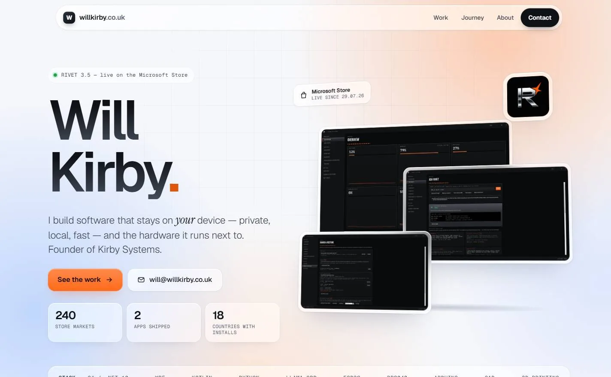

# willkirby.co.uk

My personal site. Plain HTML, CSS and JavaScript: no framework, no build step, no trackers.



## What's in it

- **Bright liquid glass:** frosted white panels over slow peach and pale-blue light blooms
- **3D hero:** real RIVET 3.5 screenshots in glass frames that tilt towards the mouse. The tilt is off for touch screens and `prefers-reduced-motion`.
- **Accessible:** every text colour is contrast-checked to 4.5:1, there's a skip link, real links and buttons, and alt text on every screenshot. Lighthouse accessibility, best practices and SEO all score 100.
- **Light:** WebP images with `srcset`, about 0.9 MB for the whole image set. LCP is around 0.8 s on a throttled phone.

## Structure

```
index.html
css/styles.css
js/main.js         hero tilt (the only script)
img/               web-ready WebP images, generated
images/            original screenshots, untouched
tools/optimize.py  rebuilds img/ from images/
```

## Run locally

```bash
python -m http.server 8137
```

Then open http://localhost:8137.

## Images

Put originals in `images/`, add them to the `JOBS` list in `tools/optimize.py`, then run:

```bash
python tools/optimize.py
```

Fonts: Geist, Geist Mono and Instrument Serif from Google Fonts.
